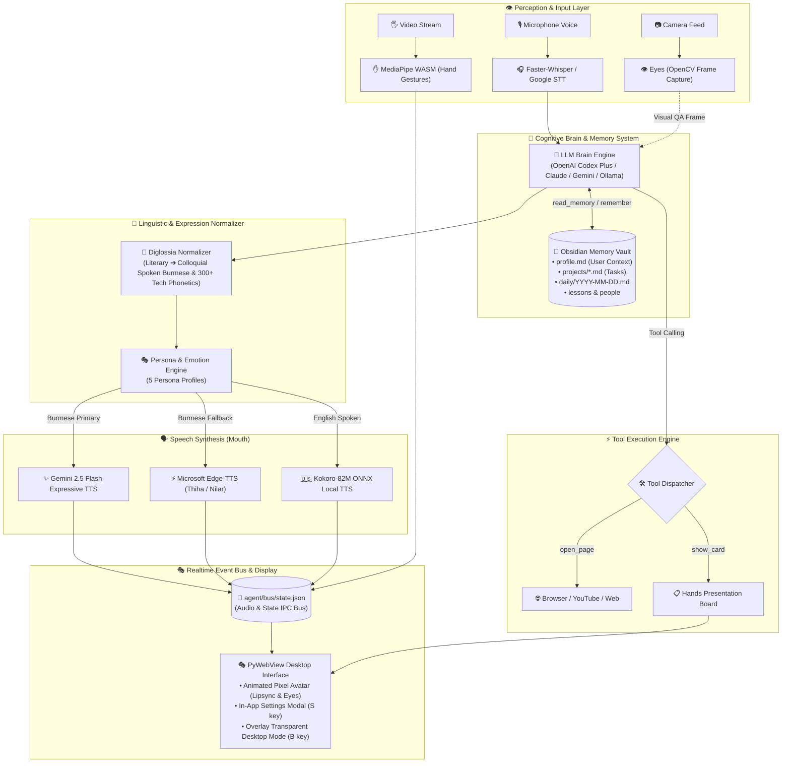

<p align="center">
  
</p>

# Lugalay

A personal AI desktop companion for macOS, Windows, and Linux: a **mind**, a **mouth**, a **face**, a pair of **hands**, and a set of **eyes**. It listens in Burmese and English, answers with natural colloquial spoken rhythm, and watches you from an animated pixel avatar. 



---

## 🛠️ Tech Stack

| Domain | Technologies & Frameworks |
|---|---|
| **Core & Desktop Engine** |       |
| **Brain & Reasoning LLMs** |    -000000?style=flat-square&logo=ollama&logoColor=white) |
| **Long-Term Memory** |   |
| **Speech-to-Text (STT)** | -000000?style=flat-square&logo=openai&logoColor=white)  |
| **Text-to-Speech (TTS)** |    |
| **Vision & Gestures** |   |
| **Build & Distribution** |   |

---

## 🚀 Quick Start

Download the pre-built application for your operating system from [GitHub Releases](https://github.com/burmeseitman/lugalay/releases):

* **macOS (Apple Silicon & Intel)**: Open the `.dmg` file and drag `Lugalay.app` to `/Applications`.
* **Windows (x64)**: Unzip `Lugalay-windows-x86_64.zip` and run `Lugalay.exe`.
* **Linux (x64)**: Extract `Lugalay-linux-x86_64.tar.gz` and run `./Lugalay`.

Or run directly from source:

```bash
python3 agent/app.py
```

Then just talk. There is no key to hold: it calibrates the room, listens to your voice, and speaks back naturally.

---

## ⌨️ Keys & Shortcuts

| Key | Action |
|---|---|
| **1-5** | Switch persona — face **and** voice (Aung, Hnin, Zaw, Mya, U Ba) |
| **S** | Open **In-App Settings** modal (configure names, languages, persona, API keys) |
| **B** | Overlay mode: pins transparent avatar directly onto your desktop |
| **F** | Fullscreen toggle |
| **H** | Toggle Hands & Vision board |
| **⌘Q / Ctrl+Q** | Quit (cleanly terminates audio loop, servers, and window) |

---

## ⚙️ In-App Settings

Click the **`⚙ Settings`** button (or press **`S`**) at any time to customize:

* **Assistant & User Names**: Personalize how you address each other.
* **Listening Language**: Choose between `Burmese Only`, `English Only`, or `Auto / Bilingual`.
* **Speaking Language**: Choose `Burmese`, `English`, or `Match Spoken`.
* **Voice & Face Persona**: Select between 5 distinct avatar styles and vocal profiles.
* **Gemini API Key**: Add your key for expressive Gemini 2.5 Flash TTS. Without a key, Lugalay runs 100% free with Microsoft Edge-TTS.

---

## 🎭 The Five Personas

| Key | Persona | Gender | Burmese Voice | English Voice |
|---|---|---|---|---|
| **1** | **Aung** | Male (24) | `my-MM-ThihaNeural` (Clear, Energetic) | `am_adam` |
| **2** | **Hnin** | Female (22) | `my-MM-NilarNeural` (Sweet, Calm) | `af_heart` |
| **3** | **Zaw** | Male (42) | `my-MM-ThihaNeural` (Mature, Confident) | `bm_lewis` |
| **4** | **Mya** | Female (40) | `my-MM-NilarNeural` (Warm, Polite) | `bf_emma` |
| **5** | **U Ba** | Male (68) | `my-MM-ThihaNeural` (Wise, Resonant) | `bm_george` |

---

## 🧠 Brain Engines, Memory & Tools

* **OpenAI Codex Plus (`engine: "codex"`)**: Runs headless via `codex exec --json` on your existing **ChatGPT / Codex Plus subscription** with zero API token overhead.
* **Claude / Local Ollama Fallback**: Cascades gracefully to local offline models (`qwen3.6`, `llama3`) or Claude when offline.
* **💾 Long-Term Memory (Obsidian Vault)**: Stores persistent context across sessions in pure Markdown:
  * `memory/profile.md`: User identity, background, preferences, and workflows.
  * `memory/projects/*.md`: Active projects, architecture decisions, and task states.
  * `memory/daily/YYYY-MM-DD.md`: Chronological daily summaries and conversations.
  * `memory/lessons/*.md`: Rules, corrections, and guidelines.
* **🛠️ Built-in Tool Calling**:
  * `read_memory(topic)`: Autonomous memory recall to look up past context before answering.
  * `remember(note, file)`: Writes durable facts and updates directly to the vault.
  * `open_page(url)`: Opens web pages, YouTube videos, or research links directly in the browser upon request.
  * `show_card(text, title)`: Generates and pins interactive notes/cards onto the visual presentation board.
* **👁️ Eyes & Camera Vision**: Multimodal visual QA (*"Look at this"*, *"ဒီဟာကို ကြည့်ပေးပါ"*) capturing live OpenCV camera frames for instant reasoning.
* **🖐️ Hands & Presentation Board**: Google MediaPipe WASM hand landmarker for real-time gesture control and canvas interaction.
* **📝 Diglossia Normalizer**: Automatically converts literary Burmese (`သည်`, `မည်`, `၌`) into colloquial spoken prose (`တယ်`, `မယ်`, `မှာ`), enforces gender particles (`ခင်ဗျာ` vs `ရှင့်`), and applies 300+ phonetic transliterations for technical terms.

---

## 📦 Building & Diagnostics

Run diagnostics from the repository root:

```bash
./agent/voice/diagnose.sh           # Test dependencies, models, mic, and brain
./agent/voice/diagnose.sh mic       # Test microphone capture
./agent/voice/diagnose.sh lang      # Test language identification
```

To build standalone application binaries locally:

```bash
pyinstaller --noconfirm --clean packaging/lugalay.spec

# On macOS (to apply code signature):
bash packaging/sign.sh dist/Lugalay.app
```
