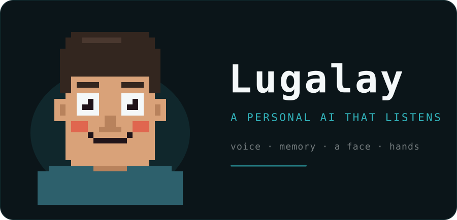

<p align="center">
  
</p>

# Lugalay

A personal AI assistant that lives on this machine: a **mind**, a **mouth**, a
**face**, and a pair of **hands**. It answers in Burmese, speaks out loud, and
watches you from a pixel avatar. The brain is Claude Code; almost everything
else runs locally.

```
you speak ──▶ language id ──┬─▶ whisper small.en   ─┐
                            └─▶ whisper-my-turbo   ─┤
                                                    ├─▶ claude -p ──┬─▶ kokoro   (English)
                                                    │               └─▶ edge-tts (Burmese)
                                                    │                      │
                            agent/bus/state.json ◀──┴──────────────────────┘
                                     │
                                     └──▶ the face
```

## Run it

Double-click **`Lugalay.app`** — on your Desktop and in this folder. It opens a
native window with no terminal and no browser. Everything that would have
scrolled past goes to `agent/logs/app.log`.

Then just talk. There is no key to hold: it calibrates the room, waits for you
to speak, and answers when you stop.

For a typed session instead, `Lugalay Chat.command` on the Desktop, or:

```bash
cd ~/Projects/luagalay && claude
```

## Keys

| key | does |
|---|---|
| **1-5** | switch person — face **and** voice |
| **B** | overlay mode: strips the card, bar and caption; just the avatar on your desktop, pinned on top |
| **F** | fullscreen |
| **⌘Q** | quit (stops the voice loop and face server too) |

The window has no title bar. Drag anywhere to move it.

## The five people

Each is a different pixel human — gender, age, hair, beard, skin — **and each
speaks in its own voice.** Picking a face picks the voice: the page tells the
server, and the voice loop reads it before it next speaks, so switching
mid-conversation changes the next reply.

| key | who | Burmese voice | English voice |
|---|---|---|---|
| 1 | Aung, m24 | Thiha, faster and higher | `am_michael` |
| 2 | Hnin, f22 | Nilar, faster and higher | `af_heart` |
| 3 | Zaw, m42 | Thiha, natural | `bm_lewis` |
| 4 | Mya, f40 | Nilar, slightly lower | `bf_emma` |
| 5 | U Ba, m68 | Thiha, slower and lower | `bm_george` |

Burmese has exactly **two** neural voices in existence — one male, one female —
so age is carried by rate and pitch rather than a different voice. English has a
real voice per person from Kokoro.

Whoever is on screen, the expression follows the conversation. **Nothing bobs or
shakes.** Only the eyes, eyebrows and mouth move, and the mouth is driven by the
real playback amplitude, so it genuinely lip-syncs.

| state | expression |
|---|---|
| idle | soft smile, blinks on its own, eyes glance around |
| listening | brows up, eyes wide, sound bars either side scaled by your mic |
| thinking | brows furrowed, eyes half-lidded looking up, thought bubble |
| speaking | mouth opens with the audio, alternating "ah" and "oh" shapes |

Add or edit people in `faces` in `agent/config.json` — appearance and voice sit
in one entry, and a sixth person just appears on key 6.

## Language

Burmese is the default. It answers in Burmese, speaks it aloud, and keeps code,
commands and file paths in English inside the sentence.

**You can speak English or type Burmese. You cannot speak Burmese well.**

That last one is the real limitation in this stack, and it is not a bug to fix:

| | |
|---|---|
| Replying in Burmese | works |
| Speaking Burmese aloud | works |
| Reading Burmese you type | works |
| **Hearing Burmese you speak** | **poor** |

Stock Whisper cannot transcribe Burmese at all — with auto-detect it hears
Burmese as Thai and writes Thai script. A community fine-tune
(`whisper-my-turbo`) does produce Burmese, but measured **82.9% character error
rate** on real speech in this room. It catches the gist and mangles the words.
Decoder settings made no difference; a larger fine-tune was worse and 4× slower.

If it matters enough, the honest fix is a paid cloud STT with real Burmese
support — Azure, Google or ElevenLabs Scribe. Nothing free is good enough yet.

## How it decides which language you spoke

Whisper's language id **never returns "my" for real Burmese** — on this machine
it answers `zh`, `th` or `cy`. English it identifies confidently (p ≥ 0.8). So
the router asks only *"was that English?"* and treats everything else as
Burmese, which is also the default here.

```
you speak → whisper base decides (0.2s)
            ├─ en, p ≥ 0.5 → small.en          (~0.9s)
            └─ anything else → whisper-my-turbo (~3.7s)
```

The reply follows the language you spoke.

## Speed

Roughly **10 seconds** from when you stop talking to the first word out loud, in
Burmese. English is faster.

| stage | time |
|---|---|
| silence before it acts | 0.65s |
| transcribe (Burmese) | ~3.7s |
| brain → first sentence | ~2.5s |
| synthesise and start speaking | ~2.5s |
| **you stop talking → first word** | **~9-10s** |

Three things buy that: replies are **streamed**, so it speaks the opening
sentence while still writing the rest; `--strict-mcp-config` and
`--disable-slash-commands` keep each turn from loading MCP servers and the skill
catalogue (~1.5s); and the silence window is short.

Two floors cannot be tuned away. Whisper pads every clip to a 30-second window
internally, so a 4-second sentence costs the same as a 25-second one. And the
brain needs ~2.5s to produce a first sentence.

## The brain, and the free fallback

`brain.engine` is `auto`: **Claude Code normally, `qwen3:8b` locally when Claude
fails** — usage limits, offline, billing.

|  | Claude | qwen3:8b |
|---|---|---|
| Burmese quality | good | coherent, sometimes clumsy |
| Reads and writes the memory vault | yes | **no** |
| Runs commands, repairs itself | yes | **no** |
| Offline | no | yes |
| Cost | subscription | free |

The local model has no tools — that is inherent. To compensate, `memory/profile.md`
is injected into its system prompt so it still knows who you are, but it cannot
write new memories or fix its own body.

> Do not use `qwen3.6:27b`. It is 17GB and this Mac has 18GB; it will swap and
> may lock up the machine.

## Layout

| path | what it is |
|---|---|
| `Lugalay.app` | the desktop app |
| `CLAUDE.md` | who Lugalay is — edit to change its personality |
| `memory/` | the mind: an Obsidian vault it reads **and writes** |
| `agent/config.json` | every setting, and the only place your name lives |
| `agent/app.py` | starts everything, owns the native window |
| `agent/setup.py` | first-run: name, language, persona |
| `agent/templates/` | `CLAUDE.md` and `profile.md` are rendered from here |
| `agent/voice/` | listening, thinking, speaking |
| `agent/face/` | the avatar (`:7317`) |
| `agent/hands/` | the webcam board (`:7318`) and the `present` verb |
| `agent/bus/` | how the pieces talk to each other |
| `agent/logs/` | everything the app prints |

### The bus

The whole integration is two JSON files. No sockets, no broker, deliberately.

```
state.json   voice ──▶ face     what Lugalay is doing, and how loud
face.json    face  ──▶ voice    who Lugalay is right now
```

## First run on a new machine

`setup_done: false` makes the first launch open a setup screen instead of the
face: your name (pre-filled from the macOS account, never assumed), the
assistant's name, the reply language, and the starting person.

The microphone does not start until that is done — the greeting has to know who
it is talking to.

Setup writes the name to `agent/config.json` and renders `CLAUDE.md` and
`memory/profile.md` from `agent/templates/`, so **the name lives in exactly one
place**. Existing files are backed up to `*.before-setup` first.

To redo it: set `setup_done` to `false` and relaunch, or

```bash
python3 agent/setup.py
```

## Permissions macOS will ask for

- **Microphone** — required. Denied, it returns digital silence rather than an
  error, which looks exactly like a broken mic.
- **Camera** — only for the hands board.

Accessibility and Input Monitoring are **not** needed. They were, back when
there was a push-to-talk key; hands-free listening watches no keys.

## When it breaks

Ask Lugalay — it is instructed to repair itself, and `agent/TROUBLESHOOTING.md`
is written for it to read. Or run the checks yourself:

```bash
./agent/voice/diagnose.sh           # every dependency, model, the mic, the brain
./agent/voice/diagnose.sh mic       # is the microphone actually delivering audio?
./agent/voice/diagnose.sh lang      # record your voice, show how the router sees it
./agent/voice/diagnose.sh tune      # score Burmese decoding against a known sentence
```

Each writes to `agent/logs/`, so you can hand me the file rather than retype what
it said.

Run them from the same terminal app you launch from — macOS grants permission per
app bundle, so results from anywhere else mean nothing. Use the wrapper rather
than the scripts directly: they need the venv, and a bare `python3` has none of
their dependencies.

## What is local, and what is not

Local, offline, private: speech recognition, English speech synthesis, the
avatar, the hand tracking (vendored, no CDN), and the memory vault.

Two things leave this machine: the **reasoning**, through Claude Code, and the
**Burmese voice**, because Microsoft's `my-MM` is the only free Burmese TTS that
exists — Kokoro has none and neither does macOS. Offline, Burmese sentences are
skipped rather than read aloud in an English voice; English still works.

About **6.9GB** on disk, mostly speech models.
